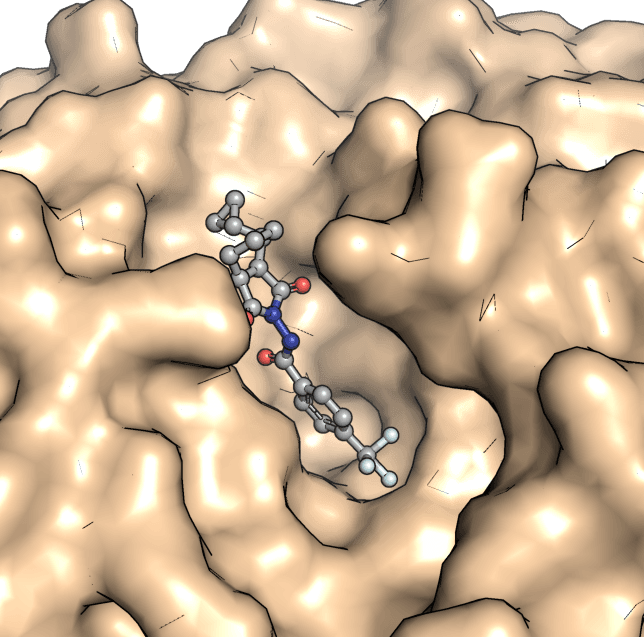

# MPXV_research
Researches about Monkeypox virus
```
.
├── LICENSE
├── README.md
└── tecovirimat # files for tecovirimat docking to Envelope protein F13
    ├── F13.pdb
    ├── F13_pocket.pdb
    ├── all.sh
    ├── get_box_center.sh
    ├── lig.pdb
    └── lig_mini_out.pdbqt # docking results
    
```
## Tecovirimat docking to Envelope protein F13
You may need openbable, ADFR and vina already installed! Or you can simple open F13.pdb and lig_mini_out.pdbqt using pymol
```
# for running docking by youself
cd tecovirimat
bash +x all.sh
```
